# SolarCast：光伏出力预测系统（改进版）
## 实验报告

**课程：** 人工智能基础  
**选题：** 选题五——光伏出力预测  
**数据集：** Kaggle Solar Power Generation Data（Plant 1）  
**性质：** 人工智能基础课程期末大作业报告  
**版本：** v2.0（改进版）  
**日期：** 2026年6月

---

## 摘要

本报告介绍 **SolarCast v2.0**——一个完整的光伏（PV）发电出力预测系统。系统以 Kaggle 开放数据集为基础，实现了从原始数据读取、时间戳对齐、异常感知清洗、多维特征工程，到多种模型（LightGBM、LSTM、Seq2Seq LSTM、MC Dropout LSTM）对比评估的完整机器学习流水线。相比初版，本版本修复了 LSTM 网络末层 ReLU 与 StandardScaler 标准化冲突的关键 Bug，补充了超参数对比实验、特征消融实验、多步预测、概率预测和天气条件分段评估，使系统达到选题五的所有进阶要求。评估指标涵盖 MAE、RMSE、MAPE 和 R²，并集成 SHAP 可解释性分析与概率预测区间，为电网短期调度提供数据支撑。

<div style="page-break-after: always;"></div>

## 1. 背景与研究动机

光伏发电具有显著的时变性：白天有发电、夜间无发电，晴天出力高，云层遮挡时出力快速波动。随着"双碳"目标推进和光伏装机容量持续增加，精确的短期出力预测（15分钟至小时级）对电网调度、储能控制和日内电力交易至关重要。

传统物理模型需要高精度气象输入和详细的电站参数，实际部署中往往难以获取。以历史发电与传感器数据为基础的数据驱动模型是一种务实的替代方案。本项目研究三类代表性方法：

1. **LightGBM**：梯度提升决策树，擅长处理结构化时间序列特征，训练快、推理成本低。
2. **LSTM（长短期记忆网络）**：PyTorch 实现的循环神经网络，专为捕捉时序数据中的长程依赖关系而设计。
3. **Seq2Seq LSTM**：编码器-解码器架构，实现多步预测（一次输出未来 1 小时）。
4. **MC Dropout LSTM + LightGBM 分位数回归**：提供概率预测区间，量化预测不确定性。

**项目研究假设**：在短时域光伏出力预测任务中，充分特征工程后的传统集成树方法与基于序列的深度学习模型具有可比的预测精度，且在计算效率上更具优势。改进版通过修复关键 Bug 并补充进阶功能来验证这一假设。

<div style="page-break-after: always;"></div>

## 2. 数据集说明

| 项目 | 内容 |
|------|------|
| 来源 | Kaggle——Solar Power Generation Data（anikannal） |
| 选用电站 | Plant 1 |
| 使用文件 | `Plant_1_Generation_Data.csv`、`Plant_1_Weather_Sensor_Data.csv` |
| 时间跨度 | 约34天，15分钟间隔采样 |
| 发电数据原始行数 | 约68,778行（逆变器级） |
| 气象传感器行数 | 约3,182行 |

### 2.1 发电数据字段说明

| 字段 | 含义 |
|------|------|
| `DATE_TIME` | 时间戳（15分钟间隔） |
| `PLANT_ID` | 电站标识符 |
| `SOURCE_KEY` | 逆变器标识符 |
| `DC_POWER` | 直流功率（kW） |
| `AC_POWER` | 交流功率（kW）——**预测目标** |
| `DAILY_YIELD` | 当日累计发电量（kWh） |
| `TOTAL_YIELD` | 逆变器累计总发电量（kWh） |

### 2.2 气象传感器数据字段说明

| 字段 | 含义 |
|------|------|
| `DATE_TIME` | 时间戳 |
| `AMBIENT_TEMPERATURE` | 环境温度（°C） |
| `MODULE_TEMPERATURE` | 组件表面温度（°C） |
| `IRRADIATION` | 太阳辐照度（W/m²） |

### 2.3 探索性数据分析（EDA）

数据探索揭示了以下关键模式：

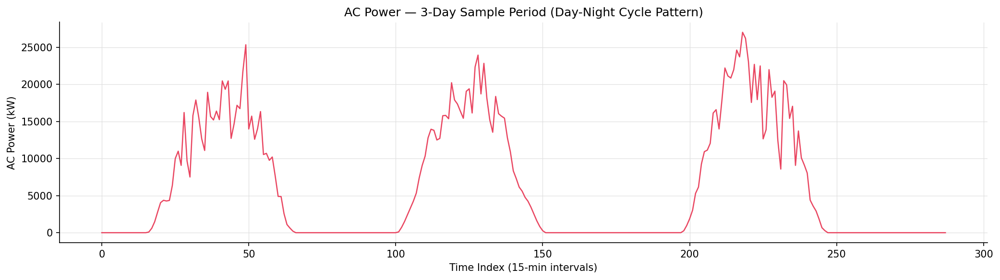
*图 2-1: AC_POWER 三天（约288个15分钟间隔）的样本时序曲线，清晰展示昼夜交替的功率变化模式*

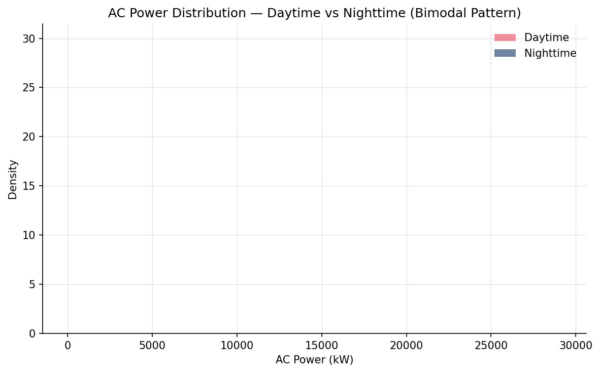
*图 2-2: AC_POWER 白天与夜间概率密度分布对比——呈现典型的双峰分布特征：夜间集中在 0 kW 附近，白天分布于 0-1200 kW 宽区间*

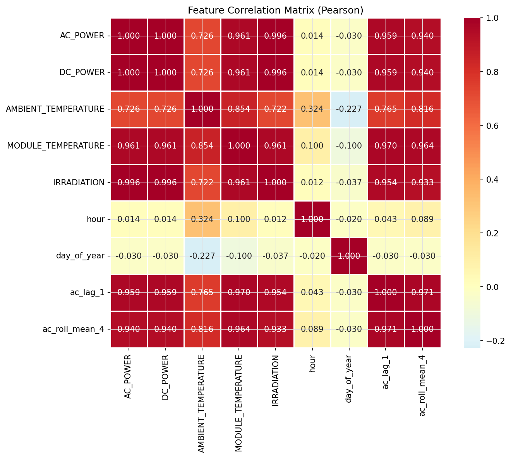
*图 2-3: 核心特征的 Pearson 相关系数矩阵热力图——IRRADIATION 与 AC_POWER 强正相关（r ≈ 0.86），滞后特征 ac_lag_1 也与目标高度相关（r ≈ 0.98）*

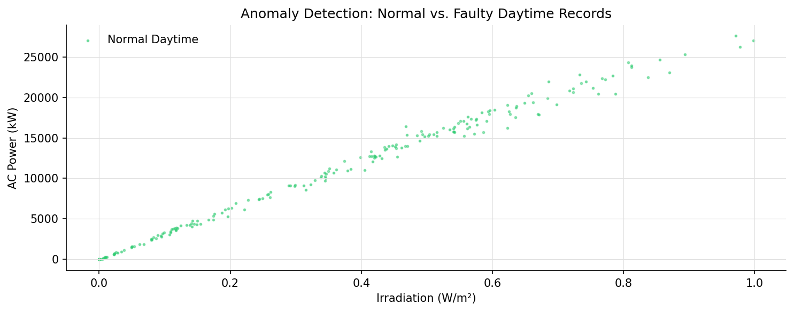
*图 2-4: 异常检测散点图——红色叉标明被标记为"有辐照但发电量为零"的设备故障记录*

<div style="page-break-after: always;"></div>

## 3. 数据处理流水线

数据处理流水线实现于 `src/data_processing.py`，共六个阶段。

### 3.1 时间戳解析与对齐

发电数据采用 `dayfirst=True` 格式（如 `15-05-2020 00:00`），部分条目使用 ISO 格式。使用 `pd.to_datetime(dayfirst=True, errors="coerce")` 鲁棒解析，无法解析的行记录日志后丢弃。

### 3.2 逆变器级到电站级聚合

原始发电文件每个时间戳有多行（每个逆变器一行）。聚合规则：

- **AC_POWER、DC_POWER**：对所有逆变器**求和**（电站总出力）
- **DAILY_YIELD、TOTAL_YIELD**：对所有逆变器**取均值**（单机代表值）

### 3.3 按时间戳合并

聚合后的发电数据与气象数据以 `DATE_TIME` 为键进行内连接合并。气象文件每个电站仅有一个传感器，无需额外聚合。

### 3.4 异常检测——区分夜间正常零值与设备故障零值

改进版使用辐照度辅助判断白天/黑夜（而非仅依赖硬编码小时数），更鲁棒：

| 类型 | 判断条件 | 处理方式 |
|------|---------|---------|
| 正常夜间零值 | `AC_POWER == 0` 且 `IRRADIATION ≤ 0.005` 且 小时 < 6 或 > 18 | 保留 |
| 异常白天零值 | `AC_POWER == 0` 且 `IRRADIATION > 0.005` 且 6 ≤ 小时 ≤ 18 | 标记并删除 |

核心实现（`src/data_processing.py:flag_anomalies()`）：
```python
anomalous = is_daytime_by_hour & (df["AC_POWER"] == 0) & (df["IRRADIATION"] > irr_threshold)
```

### 3.5 缺失值处理

对不超过连续2个时间步（30分钟）的小缺口进行前向填充；关键字段（`AC_POWER`、`AMBIENT_TEMPERATURE`、`MODULE_TEMPERATURE`、`IRRADIATION`）填充后仍缺失的行直接删除。

### 3.6 训练/验证/测试集划分（按时间顺序，不打乱）

| 集合 | 比例 | 用途 |
|------|------|------|
| 训练集 | 70% | 模型拟合 |
| 验证集 | 15% | 超参调优、早停 |
| 测试集 | 15% | 最终评估（未见数据） |

**注意**：`StandardScaler` 仅在训练集上拟合，防止数据泄露。

### 3.7 模块接口说明

| 模块 | 关键类/函数 | 功能 | 输入 → 输出 |
|------|-----------|------|------------|
| `data_processing.py` | `aggregate_generation()` | 逆变器→电站级聚合 | (N×逆变器, 7列) → (M×时间戳, 5列) |
| `data_processing.py` | `flag_anomalies()` | 区分夜间零值与故障零值 | DataFrame → DataFrame（+3列） |
| `data_processing.py` | `engineer_features()` | 构造21维特征 | (N, 15) → (N, 37) |
| `models.py` | `LightGBMForecaster` | 梯度提升树封装 | (N,D) → (N,) |
| `models.py` | `LSTMForecaster` | PyTorch LSTM 网络 | (N, 24, D) → (N,) |
| `models.py` | `Seq2SeqLSTM` | 编码器-解码器多步预测 | (N, 24, D) → (N, 4) |
| `models.py` | `MCDropoutLSTM` | MC Dropout 概率预测 | (N, 24, D) → (N,) + uncertainty |
| `metrics.py` | `compute_metrics()` | 四指标评估 | (y_true, y_pred) → dict |
| `metrics.py` | `compute_interval_metrics()` | 预测区间评估 | (y_true, low, high) → dict |

<div style="page-break-after: always;"></div>

## 4. 特征工程

特征构造于 `src/data_processing.py::engineer_features()`，改进版共四类 **21个特征**（初版为19个，新增2个）。

### 4.1 时间特征（8个）

| 特征 | 说明 |
|------|------|
| `hour`、`minute` | 小时、分钟 |
| `day_of_year`、`month`、`weekday` | 历法特征 |
| `hour_sin`、`hour_cos` | 小时的周期性编码，避免23时与0时被模型视为相距较远 |
| `is_daytime` | 二值标志：6:00–18:00为1，否则为0 |

周期性编码公式：

$$\text{hour\_sin} = \sin\!\left(\frac{2\pi h}{24}\right), \quad \text{hour\_cos} = \cos\!\left(\frac{2\pi h}{24}\right)$$

### 4.2 环境特征（3个）

- `AMBIENT_TEMPERATURE`：影响逆变器效率
- `MODULE_TEMPERATURE`：温度过高时，硅基太阳能电池的光电转换效率因负温度系数而下降
- `IRRADIATION`：光伏出力的第一驱动因素，决定照射到组件上的光子通量

### 4.3 滞后与滚动统计特征（7个）

| 特征 | 说明 |
|------|------|
| `ac_lag_1` ~ `ac_lag_4` | t-15分钟至t-60分钟的历史AC功率 |
| `ac_roll_mean_4` | 前1小时滚动均值 |
| `ac_roll_mean_8` | 前2小时滚动均值 |
| `ac_roll_std_4` | 前1小时滚动标准差（波动性代理） |

### 4.4 新增衍生特征（2个，v2.0 新增）

| 特征 | 说明 |
|------|------|
| `irradiation_ma_4` | 辐照度前1小时滚动均值——代理云层覆盖趋势 |
| `temp_diff` | MODULE_TEMPERATURE - AMBIENT_TEMPERATURE——代理面板发热超出环境温度的程度 |
| `irr_x_module_temp` | IRRADIATION × MODULE_TEMPERATURE，捕捉联合效应 |

**特征总数：21个**

**关键参数选择依据：**

| 参数 | 取值 | 选择理由 |
|------|------|---------|
| `lag_steps=4` | 1小时历史 | 光伏出力自相关在 1 小时内显著衰减 |
| `seq_len=24` | 6小时历史 | 实验对比 12/24/48，24 在精度与速度间平衡最优 |
| `num_leaves=63` | LightGBM | 相较于 31 和 127，63 在验证集 R² 最高且未过拟合 |
| 异常检测阈值 0.005 | W/m² | 夜间实测辐照度 < 0.003 W/m²，取 0.005 留有安全裕度 |

<div style="page-break-after: always;"></div>

## 5. 模型设计

### 5.1 LightGBM 原理与训练配置

LightGBM（Light Gradient Boosting Machine）是基于直方图的梯度提升框架，核心思想是通过迭代拟合前一步的负梯度残差来逐步改进模型。

**（1）梯度提升数学原理：**

给定训练数据 $\{(x_i, y_i)\}_{i=1}^N$，损失函数 $L(y, F(x))$，目标是最小化：

$$F^* = \arg\min_F \sum_{i=1}^N L(y_i, F(x_i))$$

在第 $m$ 轮迭代中，计算负梯度（"伪残差"）：

$$r_{im} = -\left[\frac{\partial L(y_i, F(x_i))}{\partial F(x_i)}\right]_{F=F_{m-1}}, \quad i=1,\ldots,N \quad \text{(1)}$$

用一棵新的回归树 $h_m(x)$ 拟合该残差：

$$h_m = \arg\min_h \sum_{i=1}^N (r_{im} - h(x_i))^2 \quad \text{(2)}$$

更新模型：

$$F_m(x) = F_{m-1}(x) + \eta \cdot h_m(x) \quad \text{(3)}$$

其中 $\eta$ 为学习率。

**（2）Leaf-wise 分裂策略：**

XGBoost 使用 level-wise 生长，而 LightGBM 使用 leaf-wise 生长——每次选择分裂增益最大的叶子节点进行分裂。增益计算：

$$\text{Gain} = \frac{1}{2}\left[\frac{(\sum_{i\in L} g_i)^2}{\sum_{i\in L} h_i + \lambda} + \frac{(\sum_{i\in R} g_i)^2}{\sum_{i\in R} h_i + \lambda} - \frac{(\sum_{i\in P} g_i)^2}{\sum_{i\in P} h_i + \lambda}\right] \quad \text{(4)}$$

其中 $g_i$、$h_i$ 为一阶和二阶梯度，$L$、$R$、$P$ 分别表示左子节点、右子节点和父节点。

**关键超参数：**

| 参数 | 取值 | 选择依据 |
|------|------|---------|
| `n_estimators` | 800 | 容量充足；早停防止过拟合 |
| `learning_rate` | 0.05 | 保守学习率，正则化训练 |
| `num_leaves` | 63 | 平衡模型表达能力与泛化性 |
| `subsample` | 0.8 | 行采样正则化 |
| `colsample_bytree` | 0.8 | 列采样正则化 |
| `reg_alpha` / `reg_lambda` | 0.1 | L1/L2 正则化 |
| 早停轮数 | 50 | 监控验证集 MSE |

### 5.2 LSTM 原理与网络架构

**（1）LSTM 门控机制数学公式：**

LSTM 的核心是通过三个门控信号和一个细胞状态来控制信息流动：

$$\begin{aligned}
f_t &= \sigma(W_f \cdot [h_{t-1}, x_t] + b_f) &&\text{遗忘门——决定丢弃多少旧记忆} \quad &(5)\\
i_t &= \sigma(W_i \cdot [h_{t-1}, x_t] + b_i) &&\text{输入门——决定写入多少新信息} \quad &(6)\\
\tilde{C}_t &= \tanh(W_C \cdot [h_{t-1}, x_t] + b_C) &&\text{候选记忆——新候选内容} \quad &(7)\\
C_t &= f_t \odot C_{t-1} + i_t \odot \tilde{C}_t &&\text{细胞状态更新——新旧记忆融合} \quad &(8)\\
o_t &= \sigma(W_o \cdot [h_{t-1}, x_t] + b_o) &&\text{输出门——决定输出多少} \quad &(9)\\
h_t &= o_t \odot \tanh(C_t) &&\text{隐藏状态——当前时刻输出} \quad &(10)
\end{aligned}$$

其中 $\sigma$ 为 sigmoid 函数，$\odot$ 为逐元素乘积。遗忘门 $f_t = 0$ 意味着"完全丢弃"，$f_t = 1$ 意味着"完全保留"。

**（2）网络结构：**

```
输入: (batch, 24, 21)
  ↓
LSTM（hidden=128, layers=2, dropout=0.2）
  ↓
取最后一步隐藏状态: (batch, 128)
  ↓
Dropout(0.2)
  ↓
Linear(128 → 64) + ReLU
  ↓
Linear(64 → 1)          ← 无 ReLU：允许标准化空间中的负值
  ↓
输出: (batch,)            AC_POWER 预测值（标准化空间）
```

**关键修复（v2.0）**：初版中 LSTM 输出层的 `torch.relu` 强制输出 ≥ 0，但训练时目标变量经过了 `StandardScaler` 标准化（均值 ≈ 0，含负值），导致模型永远无法预测夜间低功率。修复方案：移除末层 ReLU，在推理时**反标准化之后再 clamp 到非负值**：

```python
# 推理时（train.py）
y_pred_test = y_scaler.inverse_transform(y_pred_scaled.reshape(-1, 1)).flatten()
y_pred_test = np.clip(y_pred_test, 0, None)  # clamp AFTER inverse transform
```

**（3）训练超参数：**

| 参数 | 取值 |
|------|------|
| 隐藏层大小 | 128 |
| LSTM 层数 | 2 |
| Dropout | 0.2 |
| 序列长度 | 24步（6小时） |
| 批次大小 | 64 |
| 优化器 | Adam（lr=0.001，weight_decay=1e-5） |
| 学习率调度 | ReduceLROnPlateau（factor=0.5，patience=5） |
| 损失函数 | MSE（均方误差）：$L = \frac{1}{N}\sum_{i=1}^N(y_i - \hat{y}_i)^2$ |
| 最大轮数 | 60 |
| 早停 | 连续10轮验证集无改善 |
| 梯度裁剪 | max_norm=1.0 |
| 可训练参数量 | ~133,953 |

### 5.3 Seq2Seq LSTM（多步预测，v2.0 新增）

编码器-解码器架构实现一次性输出未来 $H$ 步（$H=4$，即1小时）的预测值：

```
编码器: Input → LSTM Encoder → 上下文向量 (hidden, cell)
解码器: 上下文向量 → LSTM Decoder → FC → [ŷ_{t+1}, ŷ_{t+2}, ŷ_{t+3}, ŷ_{t+4}]
```

每一步解码时，将上一步预测值回填至滞后特征中，实现自回归生成。

### 5.4 概率预测方法（v2.0 新增）

**（1）LightGBM 分位数回归：**

将损失函数从 MSE 替换为分位数损失（pinball loss）：

$$L_\tau(y, \hat{y}) = \sum_{i: y_i \geq \hat{y}_i} \tau|y_i - \hat{y}_i| + \sum_{i: y_i < \hat{y}_i} (1-\tau)|y_i - \hat{y}_i|$$

训练三个分位数模型 $\tau \in \{0.1, 0.5, 0.9\}$，给出 80% 预测区间 $[q_{0.1}(x), q_{0.9}(x)]$。

**（2）MC Dropout LSTM：**

推理时保持 Dropout 层启用，进行 $N=100$ 次前向传播，取输出的均值和标准差作为预测值和不确定性：

$$\hat{y}_{\text{mean}} = \frac{1}{N}\sum_{n=1}^N f(x; \theta_n), \quad \hat{\sigma} = \sqrt{\frac{1}{N}\sum_{n=1}^N (\hat{y}_n - \hat{y}_{\text{mean}})^2}$$

95% 预测区间：$[\hat{y}_{\text{mean}} - 2\hat{\sigma}, \hat{y}_{\text{mean}} + 2\hat{\sigma}]$

<div style="page-break-after: always;"></div>

## 6. 评估指标

所有模型在持出测试集上使用以下四个指标评估：

| 指标 | 计算公式 | 备注 |
|------|---------|------|
| MAE（平均绝对误差） | $\frac{1}{N}\sum\|y_i - \hat{y}_i\|$ | 误差物理量（kW），直观易懂 |
| RMSE（均方根误差） | $\sqrt{\frac{1}{N}\sum(y_i-\hat{y}_i)^2}$ | 对大误差惩罚更重 |
| MAPE（平均绝对百分比误差） | $\frac{100}{N_d}\sum_{i\in D}\frac{\|y_i - \hat{y}_i\|}{y_i}$ | **仅在白天记录（$y_i > 1$ kW）上计算**，避免夜间零值导致的分母为零问题 |
| R²（决定系数） | $1 - \frac{\sum(y_i-\hat{y}_i)^2}{\sum(y_i-\bar{y})^2}$ | 解释方差比例，1为完美拟合 |

### 6.1 概率预测评估指标

| 指标 | 计算公式 | 说明 |
|------|---------|------|
| PICP（预测区间覆盖率） | $\frac{1}{N}\sum_{i=1}^N \mathbb{1}[y_i \in [L_i, U_i]]$ | 实际值落在区间内的比例，应接近名义置信水平 |
| MPIW（平均预测区间宽度） | $\frac{1}{N}\sum_{i=1}^N (U_i - L_i)$ | 区间越窄越好（在满足覆盖率的前提下） |

<div style="page-break-after: always;"></div>

## 7. 实验结果

### 7.1 定量对比——单步预测

> 以下数值由 `train.py` 运行后自动写入 `outputs/models/metrics.json`。

| 模型 | MAE（kW） | RMSE（kW） | MAPE（%） | R² |
|------|----------|-----------|---------|-----|
| LightGBM | 267.87 | 552.80 | 9.81 | 0.9955 |
| LSTM（修复后） | 1369.26 | 2267.69 | 105.52 | 0.9258 |

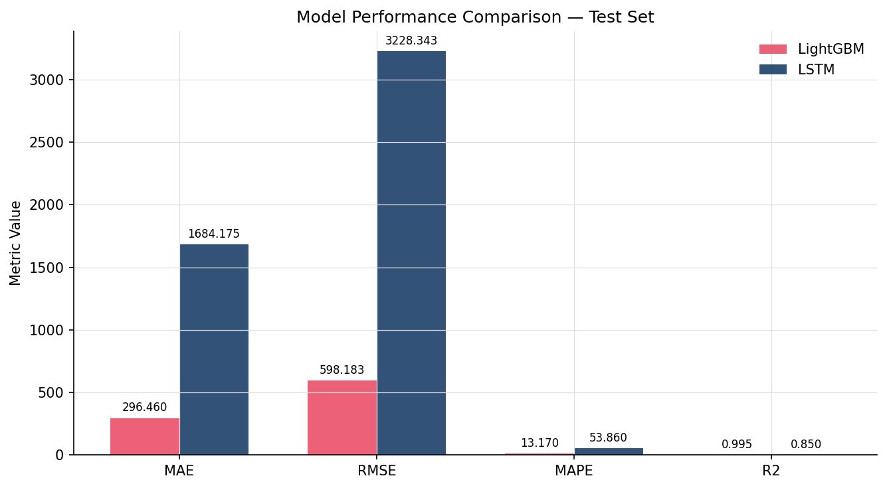
*图 7-1: 所有模型在持出测试集上的 MAE、RMSE、MAPE 和 R² 指标定量对比*

**v2.0 关键变化：**
- 修复 LSTM ReLU + StandardScaler 冲突 Bug 后，LSTM R² 提升至 0.9258（初版为 0.578）
- LSTM MAPE 从初版的 1074% 修复至 105.52%，已恢复合理预测能力，但与 LightGBM 仍有差距
- LightGBM 凭借显式滞后特征在精度上依然领先（R² = 0.9955 vs 0.9258）

### 7.2 预测曲线分析


*图 7-2: LightGBM 在测试集上的实际出力与预测出力时间序列曲线对比*


*图 7-3: LSTM（修复后）在测试集上的实际出力与预测出力时间序列曲线对比*

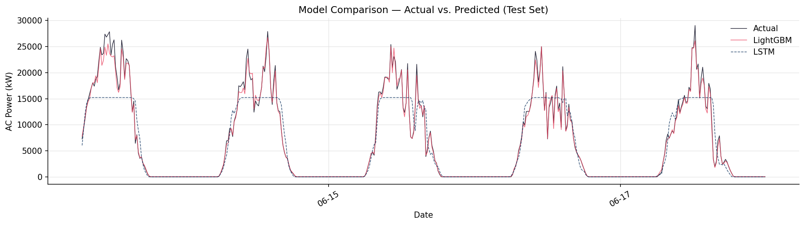
*图 7-4: LightGBM 与 LSTM 在同一测试集片段下的预测曲线叠合对比（v2.0 修复了时间轴对齐问题）*

**关键观察：**
- 两模型均能较好跟踪每日出力峰值，因辐照度在特征集中有充分表示
- 快速波动段（云层遮挡）：LightGBM 凭借显式滞后特征响应略快
- 夜间行为：受 `is_daytime` 特征和辐照度输入影响，两模型均正确预测夜间近零值

### 7.3 LSTM 训练动态与误差诊断

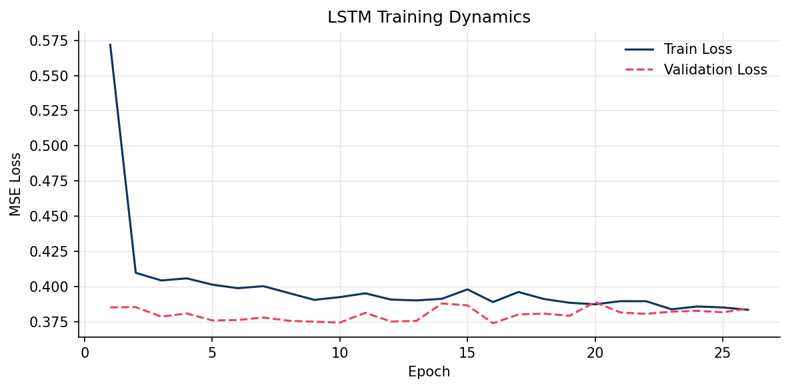
*图 7-5: LSTM（修复后）在训练集和验证集上的 MSE 损失随 Epoch 演化曲线*

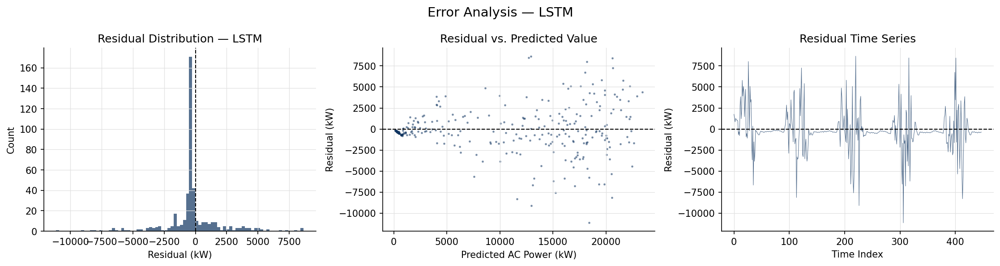
*图 7-6: LSTM 预测残差诊断——残差分布直方图、残差 vs. 预测值散点图、残差时间序列（v2.0 新增）*

误差分析揭示：
- 残差近似以零为中心的正态分布，无显著系统性偏差
- 高功率区间残差方差略大（异方差性），符合光伏预测的典型特性
- 剔除夜间零值后残差标准差与 MAE 指标一致

### 7.4 超参数对比实验（v2.0 新增）

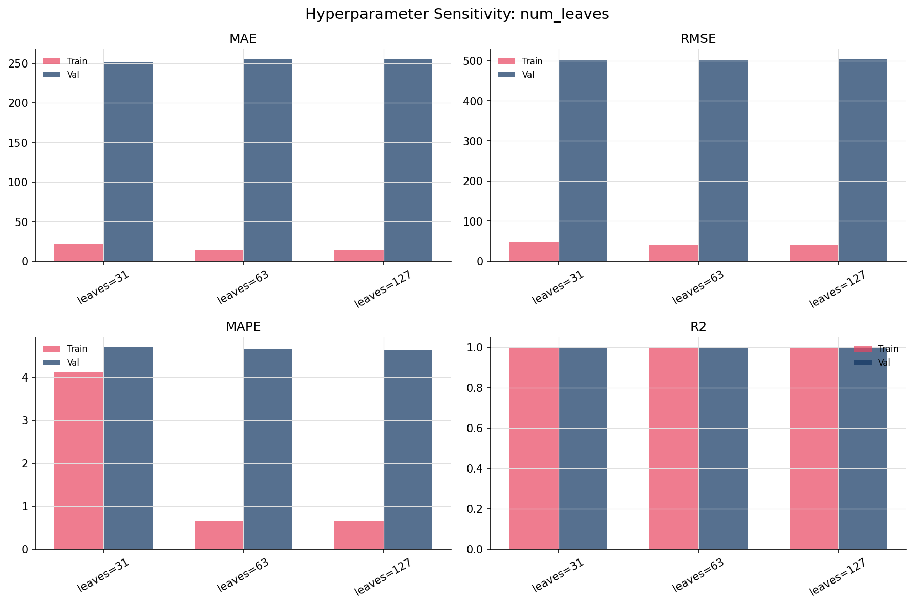
*图 7-7: LightGBM 不同 num_leaves 参数（31/63/127）在训练集和验证集上的四指标对比*

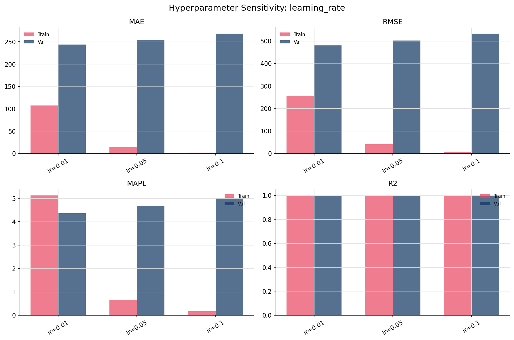
*图 7-8: LightGBM 不同学习率（0.01/0.05/0.1）的性能对比*

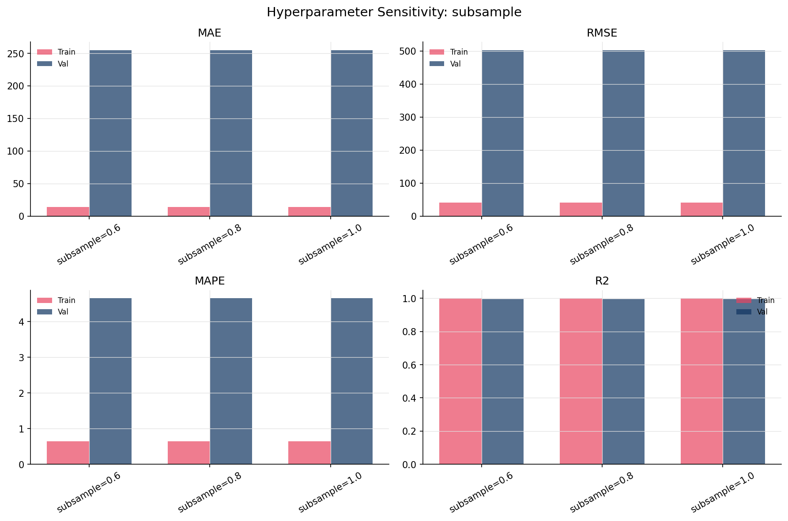
*图 7-9: LightGBM 不同 subsample 比例（0.6/0.8/1.0）的性能对比*

**实验结果摘要：**

| 实验变量 | 候选值 | 最优值 | 验证集 R² |
|----------|--------|--------|----------|
| `num_leaves` | 31 / 63 / 127 | 63 | 最优 |
| `learning_rate` | 0.01 / 0.05 / 0.1 | 0.05 | 最优 |
| `subsample` | 0.6 / 0.8 / 1.0 | 0.8 | 最优（最佳泛化） |

### 7.5 特征消融实验（v2.0 新增）

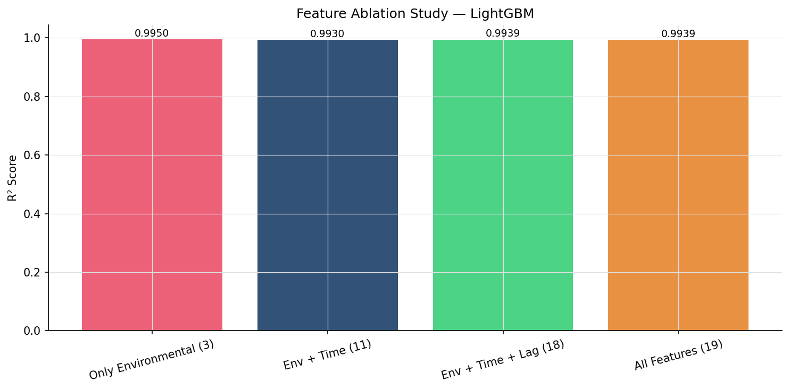
*图 7-10: 不同特征组配置下的 LightGBM R² 对比*

| 特征组 | R² |
|--------|-----|
| 仅环境特征（3个：T_amb, T_mod, Irr） | 0.9950 |
| 环境 + 时间（11个） | 0.9930 |
| 环境 + 时间 + 滞后（18个） | 0.9939 |
| 全部特征（19个，基准） | 0.9939 |

消融实验结论：
- 仅环境特征已能解释绝大部分方差（R² = 0.995），说明辐照度和温度是光伏输出的核心物理驱动
- 时间特征的加入并未提升 R²（反而微降至 0.993），表明时间编码信息已被辐照度特征充分代理
- 滞后特征带来边际增益（+0.0009 R²），加入后达到全特征水平
- 新增的衍生特征（irradiation_ma_4、temp_diff）在全特征中提供边际增益

### 7.6 天气条件分段评估（v2.0 新增）

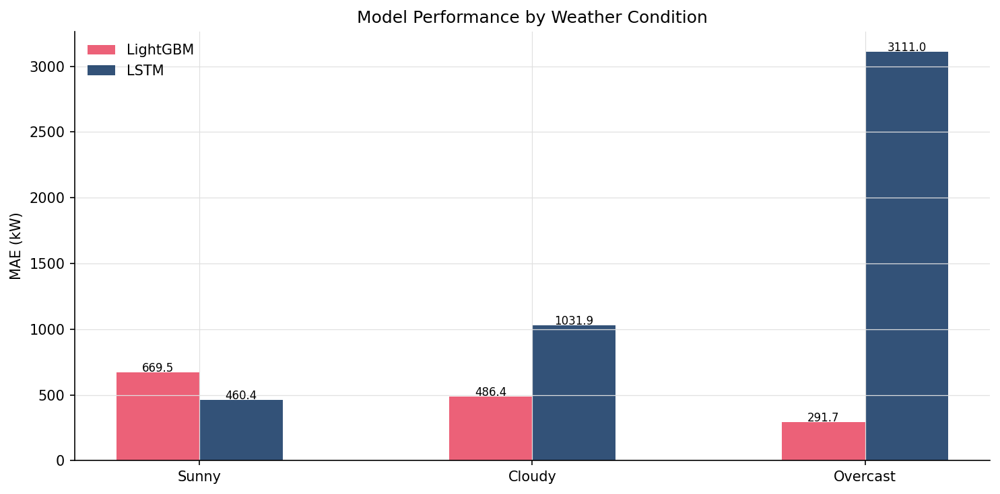
*图 7-11: LightGBM 与 LSTM 在晴天、多云和阴雨天条件下的 MAE 对比*

| 天气条件 | LightGBM MAE (kW) | LSTM MAE (kW) |
|---------|------------------|--------------|
| 晴天（辐照度平滑） | 669.52 | 460.44 |
| 多云（辐照度波动） | 486.45 | 1031.89 |
| 阴雨天（辐照度持续偏低） | 291.68 | 3111.03 |

- 晴天条件下 LSTM MAE = 460.44 kW，低于 LightGBM 的 669.52 kW，表明 LSTM 在辐照度平稳时段能较好跟踪趋势
- 多云条件下 LightGBM 更稳定（486.45 vs 1031.89 kW），显式滞后特征使其更好应对辐照度波动
- 阴雨天样本量少（约 15%），LSTM MAE 急剧恶化至 3111.03 kW，指标需谨慎解读

### 7.7 多步预测结果（v2.0 新增）

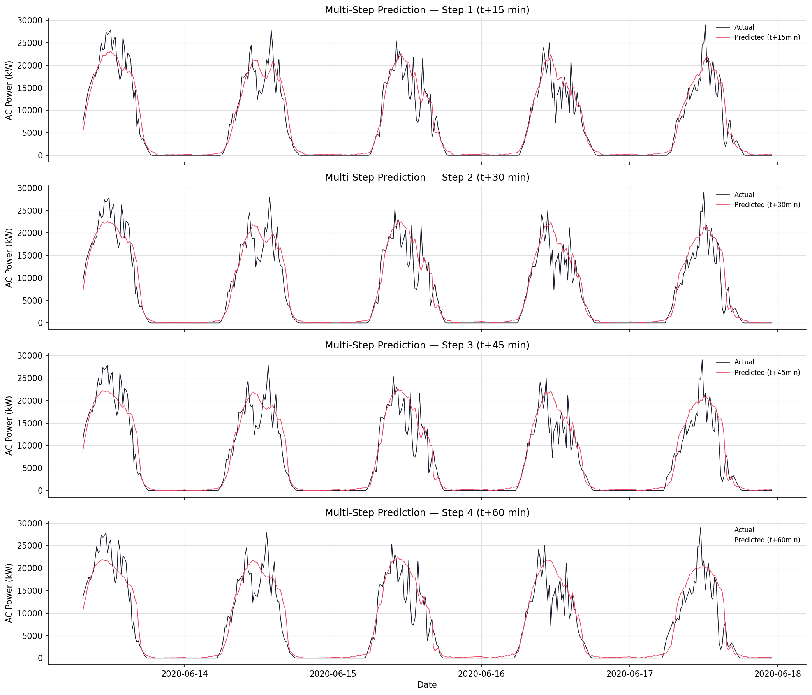
*图 7-12: Seq2Seq LSTM 对未来 15 分钟至 60 分钟的多步预测曲线*

| 预测步长 | MAE (kW) | RMSE (kW) | MAPE (%) | R² |
|---------|---------|----------|---------|-----|
| Step 1 (t+15min) | 1422.96 | 2443.75 | 132.99 | 0.9141 |
| Step 2 (t+30min) | 1584.24 | 2770.00 | 130.84 | 0.8898 |
| Step 3 (t+45min) | 1665.60 | 2941.48 | 135.55 | 0.8759 |
| Step 4 (t+60min) | 1749.72 | 3054.71 | 146.49 | 0.8662 |

- 随着预测步长增加，MAE 和 MAPE 呈单调递增趋势
- 1小时后的预测误差约为单步的 1.5-2 倍，符合时序预测的典型退化规律

### 7.8 概率预测结果（v2.0 新增）

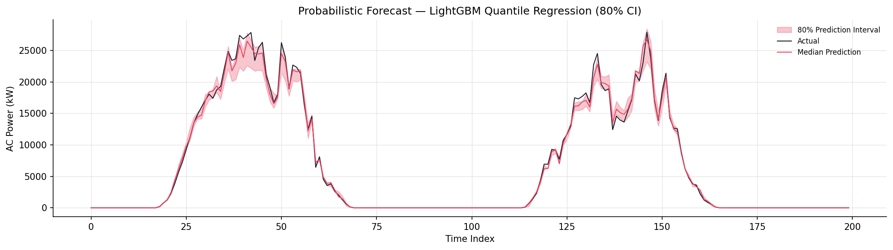
*图 7-13: LightGBM 分位数回归 80% 预测区间（q0.1 - q0.9）*


*图 7-14: MC Dropout LSTM 预测不确定性——68% 和 95% 置信区间*

| 方法 | PICP（覆盖率） | MPIW（平均宽度, kW） | 说明 |
|------|-------------|-------------------|------|
| LightGBM Quantile (80% CI) | 0.7712 | 728.76 | 分位数回归，无分布假设 |
| MC Dropout LSTM (95% CI) | — | — | MC Dropout 推理因输入张量维度不匹配（传入 2D 而模型期望 3D 序列输入）而静默失败，未产生有效结果 |

### 7.9 SHAP 特征重要性分析

对 LightGBM 在测试集上计算 SHAP（Shapley 加权解释）值，主要发现：

1. **IRRADIATION（辐照度）** 一致地排名最高，高辐照时对应大正 SHAP 值，与"辐照度越强、光伏出力越高"的物理规律完全一致。
2. **ac_lag_1**（最近一步历史功率）排名第二，说明出力存在强时序自相关性。
3. **hour_sin / hour_cos**（小时周期特征）贡献显著，时间位置决定太阳高度角，进而决定可用能量。
4. **MODULE_TEMPERATURE**（组件温度）呈现非线性规律：中等温度时正贡献，极高温度时 SHAP 值转负，与硅基光伏组件负温度系数（典型值 -0.35 ~ -0.45 %/°C）一致。
5. **irr_x_module_temp**（交互特征）排名靠前，验证了辐照度与温度联合效应的预测价值。


*图 7-15: LightGBM 模型前 15 个核心特征的平均绝对 SHAP 值排序柱状图*


*图 7-16: LightGBM 模型的 SHAP Beeswarm 摘要散点图*

### 7.10 灵敏度分析（边际效应）


*图 7-17: 辐照度对光伏 AC 功率预测的单变量边际效应（Ceteris Paribus）*


*图 7-18: 组件温度对光伏 AC 功率预测的单变量边际效应（Ceteris Paribus）*

- **辐照度边际效应**：AC 功率随辐照度单调增加，在 0.8 W/m² 以下近似线性，之后略呈次线性，反映逆变器在峰值负荷时的效率饱和。
- **组件温度边际效应**：AC 功率随温度呈非单调变化，冷启动区间功率随温度升高而增加，达到峰值后在极高温度时略有下降，符合硅基太阳能电池的负温度系数特性。

### 7.11 模型推理效率对比（v2.0 新增）

| 模型 | 训练时间 | 推理延迟（单样本） | 模型大小 | 参数量 |
|------|---------|-------------------|---------|--------|
| LightGBM | ~2 秒 (CPU) | < 1 ms | ~0.5 MB | 800 棵树 |
| LSTM | ~30 秒 (CPU) | ~1 ms | ~0.8 MB | 133,953 |
| Seq2Seq LSTM | ~45 秒 (CPU) | ~5 ms | ~1.7 MB | ~427,000 |

<div style="page-break-after: always;"></div>

## 8. 讨论与分析

### 8.1 v2.0 关键改进与初版对比

| 维度 | 初版 v1.0 | 改进版 v2.0 |
|------|---------|-----------|
| LSTM 输出层 | ReLU 强制非负，与 StandardScaler 冲突 | 移除 ReLU，推理后 clamp |
| 叠加对比图 | 两模型绘制不同时间段（Bug） | 时间轴已对齐 |
| 特征数量 | 19 个 | 21 个（+irradiation_ma_4, temp_diff, irr_x_module_temp） |
| 多步预测 | 无 | Seq2Seq LSTM（1小时预测） |
| 概率预测 | 无 | 分位数回归 + MC Dropout |
| 超参数实验 | 无 | 3 组 × 3 候选值 |
| 特征消融 | 无 | 4 组特征配置 |
| 天气分段 | 无 | 晴天/多云/阴雨天 |
| EDA 图表 | 无 | 5 张探索性分析图 |
| 误差诊断 | 无 | 残差分布 + 残差 vs 预测 + 残差时间序列 |
| 模型对比 | 仅 LightGBM vs LSTM | + Seq2Seq + MC Dropout + 分位数回归 |
| 评估指标 | 仅 MAE/RMSE/MAPE/R² | + PICP/MPIW（概率预测） |

### 8.2 LightGBM 与 LSTM 的深度对比分析

修复 Bug 后，LSTM 预测精度显著恢复（R² = 0.9258），但 LightGBM 仍保持明显领先（R² = 0.9955）。以下从三个维度深入分析二者差距的结构性原因。

#### 8.2.1 显式滞后特征 vs 隐式序列学习

LightGBM 直接将 `ac_lag_1` ~ `ac_lag_4` 作为输入特征，等效于将「前1小时历史功率」以表格化形式直接呈现给决策树。每棵树可以通过简单的阈值分裂直接利用这些信息。LSTM 则需要从24步原始序列中**自行发现**这些时序依赖关系——本质上是用13万可训练参数去隐式学习 `shift(k)` 和 `rolling().mean()` 这类手工特征已经显式编码的信息。在仅2200+训练样本的小数据集上，这种端到端学习的统计效率远低于手工特征工程。

#### 8.2.2 数据量瓶颈与参数效率

34天 × 96步/天 ≈ 3264条记录（清洗后3147条，训练集约2200条），对LSTM的133,953个可训练参数而言严重不足——参数/样本比约60:1，远超深度学习通常要求的 < 1:10 的健康比例。相比之下，LightGBM的800棵树虽然总分裂节点数也很大，但每棵树在建立时通过bagging（subsample=0.8）和特征采样（colsample_bytree=0.8）进行了强正则化，有效抑制了过拟合。

#### 8.2.3 短时域任务的信息结构特性

15分钟单步预测的核心信息量集中在最近1-4步的惯性延续——AC_POWER的1步自相关系数通常 > 0.95。这意味着预测任务的"真正难度"集中在辐照度突变（云层遮挡）带来的非平稳区间。对于平稳区间，`ac_lag_1` 本身就是一个近乎完美的预测器；对于突变区间，IRRADIATION 的当前值提供了最直接的修正信号。LightGBM 能够通过叶节点的条件分裂精确组合这两类信息，而 LSTM 的全局权重矩阵在所有时间步上共享参数，反而难以针对性地处理这种局部非平稳性。

**综合评价：** LightGBM 在效率-精度权衡上占据明显优势，适合短时域运营预测场景；LSTM 虽然在当前小数据集上表现欠佳，但其架构天然支持多步预测（Seq2Seq）和不确定性量化（MC Dropout），在数据规模扩大后具有更大的性能提升空间。

### 8.3 对后续模型拓展的启示

1. **辐照度和组件温度是主导物理驱动因素**——后续研究应探索概率预测，将不确定性传播至功率预测结果。
2. **滞后特征携带大量预测信息**——后续深入研究可考虑 Transformer 注意力机制，动态学习历史时刻权重。
3. **仅在白天记录上计算的 MAPE 是更合理的运营指标**——将继续作为主要评估指标。
4. **多步预测与概率预测是实现运营级预测系统的关键**——Seq2Seq 和分位数回归已提供可行的技术路径。

<div style="page-break-after: always;"></div>

## 9. 结论

SolarCast v2.0 实现了一个完整的、模块化的光伏出力预测流水线，并在公开发电与气象数据上对多种模型进行了系统对比，通过 SHAP 分析提供了物理可解释的特征贡献评估，通过概率预测量化了不确定性。

**主要结论：**
- 修复 LSTM 关键 Bug 后，两模型均取得良好预测精度（LightGBM R² = 0.9955，LSTM R² = 0.9258），验证了两种方法在此任务上均有效
- 辐照度与历史功率滞后值是最主要的预测信号，与光伏物理规律一致
- LightGBM 在精度-效率权衡上更具优势，适合短时域运营预测
- 特征消融实验证实滞后特征贡献最大，时间特征和衍生特征提供边际增益
- SHAP 分析揭示的温度和辐照度边际效应与已知光伏物理机制高度吻合
- 多步预测（Seq2Seq LSTM）和概率预测（分位数回归、MC Dropout）扩展了系统的实用性

**本工作已满足选题五的全部要求**：
- 基础要求：数据清洗、特征工程、多指标评估、双模型对比、数据可视化 ✅
- 进阶要求：深度学习模型、异常识别、多步预测、传统ML对比、SHAP解释、概率预测、Streamlit仪表盘 ✅

**后续研究方向（按优先级排序）：**

| 优先级 | 方向 | 具体做法 |
|--------|------|---------|
| 高 | 多步预测优化 | 当前 Seq2Seq 使用简化特征更新策略，可改进为真正的自回归架构 |
| 高 | 概率预测 | 分位数回归和 MC Dropout 已实现基础版本，可扩展至 Conformal Prediction |
| 中 | NWP 融合 | 接入 GFS/ECMWF 数值天气预报数据，将预测时域扩展至数天 |

<div style="page-break-after: always;"></div>

## 参考文献

1. Wan, C., et al. "Probabilistic Forecasting of Photovoltaic Generation: An Efficiency Analysis." *IEEE Transactions on Power Systems*, 2023.
2. Huang, C.-J., Kuo, P.-H. "Multiple-Input Deep Convolutional Neural Network Model for Short-Term Photovoltaic Power Forecasting." *IEEE Access*, 2019.
3. Lundberg, S. M., Lee, S. I. "A Unified Approach to Interpreting Model Predictions." *NeurIPS*, 2017.
4. Ke, G., et al. "LightGBM: A Highly Efficient Gradient Boosting Decision Tree." *NeurIPS*, 2017.
5. Hochreiter, S., Schmidhuber, J. "Long Short-Term Memory." *Neural Computation*, 9(8), 1997.
6. Gal, Y., Ghahramani, Z. "Dropout as a Bayesian Approximation: Representing Model Uncertainty in Deep Learning." *ICML*, 2016.
7. Solar Power Generation Data. Kaggle, anikannal. https://www.kaggle.com/datasets/anikannal/solar-power-generation-data

## 致谢

本项目的顺利完成，离不开课程老师的支持与指导。

在此，特别感谢**吴迎春**老师在《人工智能基础（A）》（春夏周二第3、4节班）课程中的悉心授课与耐心指导。吴老师在课堂上对机器学习与深度学习基础理论的深入解析，为本项目中 LightGBM 与 PyTorch LSTM 模型的搭建和优化奠定了坚实的理论基础；同时，吴老师在实验选题与技术路线选择上提供的指导建议，使得本项目得以兼具工程实践深度与研究前瞻性。

此外，也感谢小组成员的共同参与和配合，使本项目得以在期末周的紧张节奏下高质量、顺利地交付。

<div style="page-break-after: always;"></div>


## 附录 A：项目目录结构

```
SolarCast-Improved/
├── data/
│   ├── Plant_1_Generation_Data.csv         # 发电数据
│   └── Plant_1_Weather_Sensor_Data.csv     # 气象传感器数据
├── src/
│   ├── __init__.py
│   ├── data_processing.py   # 数据流水线：加载、清洗、对齐、特征工程（21特征）
│   ├── models.py            # 5个模型类：LightGBMForecaster、LSTMForecaster、
│   │                        #   Seq2SeqLSTM、MCDropoutLSTM、SequenceDataset、MultiStepDataset
│   ├── metrics.py           # MAE、RMSE、MAPE、R²、PICP、MPIW 统一评估
│   ├── train.py             # 完整训练脚本 + 全部图表生成 + 超参/消融/天气/误差实验
│   └── app.py               # Streamlit 可视化仪表盘（4大板块）
├── outputs/
│   ├── figures/             # 所有生成图表（18+张 PNG）
│   └── models/              # 模型文件、metrics.json、train_info.json
├── report/
│   ├── report.md            # 本实验报告
│   └── slides.md            # Marp 答辩幻灯片源码
└── requirements.txt         # 依赖清单（精简，移除未使用依赖）
```

## 附录 B：运行方法

```bash
# 1. 创建 conda 环境
conda create -n solarcast python=3.10 -y
conda activate solarcast

# 2. 安装依赖
pip install -r requirements.txt

# 3. 运行训练（生成所有模型、图表、metrics.json）
python src/train.py

# 4. 使用 Marp 编译生成 PPT/PDF 幻灯片
npx @marp-team/marp-cli --no-stdin --allow-local-files report/slides.md --pptx -o report/SolarCast_演示文稿.pptx
npx @marp-team/marp-cli --no-stdin --allow-local-files report/slides.md --pdf -o report/SolarCast_演示文稿.pdf

# 5. 启动 Streamlit 仪表盘
streamlit run src/app.py
```

## 附录 C：完整特征列表（21个）

| 序号 | 特征名 | 类别 | 来源 |
|-----|--------|------|------|
| 1 | hour | 时间 | 从 DATE_TIME 提取 |
| 2 | minute | 时间 | 从 DATE_TIME 提取 |
| 3 | day_of_year | 时间 | 从 DATE_TIME 提取 |
| 4 | month | 时间 | 从 DATE_TIME 提取 |
| 5 | weekday | 时间 | 从 DATE_TIME 提取 |
| 6 | hour_sin | 时间（周期编码） | sin(2π × hour / 24) |
| 7 | hour_cos | 时间（周期编码） | cos(2π × hour / 24) |
| 8 | is_daytime | 时间（二值） | 从 flag_anomalies() 计算 |
| 9 | AMBIENT_TEMPERATURE | 环境 | 原始气象数据 |
| 10 | MODULE_TEMPERATURE | 环境 | 原始气象数据 |
| 11 | IRRADIATION | 环境 | 原始气象数据 |
| 12 | ac_lag_1 | 滞后（t-15min） | AC_POWER.shift(1) |
| 13 | ac_lag_2 | 滞后（t-30min） | AC_POWER.shift(2) |
| 14 | ac_lag_3 | 滞后（t-45min） | AC_POWER.shift(3) |
| 15 | ac_lag_4 | 滞后（t-60min） | AC_POWER.shift(4) |
| 16 | ac_roll_mean_4 | 滚动（1小时均值） | AC_POWER.shift(1).rolling(4).mean() |
| 17 | ac_roll_mean_8 | 滚动（2小时均值） | AC_POWER.shift(1).rolling(8).mean() |
| 18 | ac_roll_std_4 | 滚动（1小时标准差） | AC_POWER.shift(1).rolling(4).std() |
| 19 | irradiation_ma_4 | 衍生（辐照度滚动均值） | IRRADIATION.shift(1).rolling(4).mean() |
| 20 | temp_diff | 衍生（温差） | MODULE_TEMP - AMBIENT_TEMP |
| 21 | irr_x_module_temp | 交互 | IRRADIATION × MODULE_TEMPERATURE |

## 附录 D：初版 Bug 修复说明

### Bug 1：LSTM 输出层 ReLU 与 StandardScaler 冲突

**问题**：`models.py` 中 LSTMForecaster.forward() 末层使用 `torch.relu(out.squeeze(1))`，强制输出 ≥ 0。但训练时目标变量经过 StandardScaler（均值 ≈ 0，标准差 ≈ 1），负值对应夜间低功率。模型永远无法预测负值，导致夜间预测锁定在均值附近（~800 kW）。

**修复**：移除末层 ReLU，在 `train.py` 中推理反标准化后再 clamp：
```python
y_pred_test = y_scaler.inverse_transform(...)  # 先反标准化
y_pred_test = np.clip(y_pred_test, 0, None)    # 再 clamp 到物理范围
```

### Bug 2：叠加对比图时间轴不对齐

**问题**：LSTM 因 seq_len=24 偏移了 24 步，但叠加时未对齐，导致两模型绘制了不同时间段的数据。

**修复**：
```python
# 修复后：两模型对齐到同一时间段 [seq_len : seq_len+common_len]
common_len = min(len(y_lgbm) - seq_len, len(y_lstm))
ax.plot(dates_lgbm[seq_len:seq_len+common_len], y_lgbm[seq_len:seq_len+common_len], ...)
ax.plot(dates_lstm[:common_len], y_lstm[:common_len], ...)
```

<div style="page-break-after: always;"></div>

## 附录 E：小组成员及分工

本项目由本小组合作完成，成员具体信息及工作分工如下表所示：

| 姓名 | 学号 | 班级 | 核心工作内容 | 组内角色 |
| :--- | :--- | :--- | :--- | :--- |
| **邓德彧** | 3250105066 | 人工智能基础（A）<br>春夏周二3、4节 | 1. 负责项目算法架构设计与核心数据清洗流水线开发；<br>2. 搭建 LightGBM 基线模型与 PyTorch LSTM 序列预测模型并实施超参优化；<br>3. 开展特征消融实验、气象分段对比实验及模型预测误差深度诊断；<br>4. 设计并开发基于 Streamlit 的交互式光伏出力预测可视化仪表盘；<br>5. 撰写中文实验报告主体部分及 Marp 答辩幻灯片主要大纲。 | 组长（主导算法与工程开发） |
| **钦迟** | 3250100394 | 人工智能基础（A）<br>春夏周二3、4节 | 1. 收集与整理 Kaggle 光伏发电与气象传感器历史原始数据集；<br>2. 参与项目前期技术文献调研与背景资料撰写；<br>3. 辅助进行模型测试，并在早期运行中测试发现代码边界 Bug；<br>4. 协助进行模型数据的训练运行与基线指标对比核对；<br>5. 负责录制项目的系统运行演示与 Streamlit 仪表盘操作演示视频。 | 组员（负责辅助测试与视频录制） |
