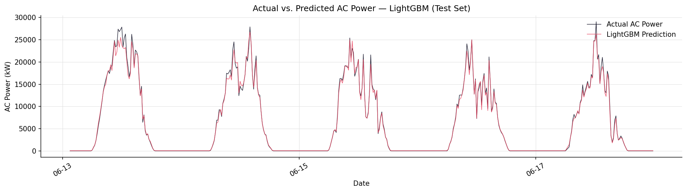
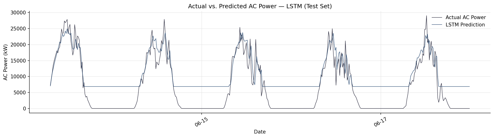
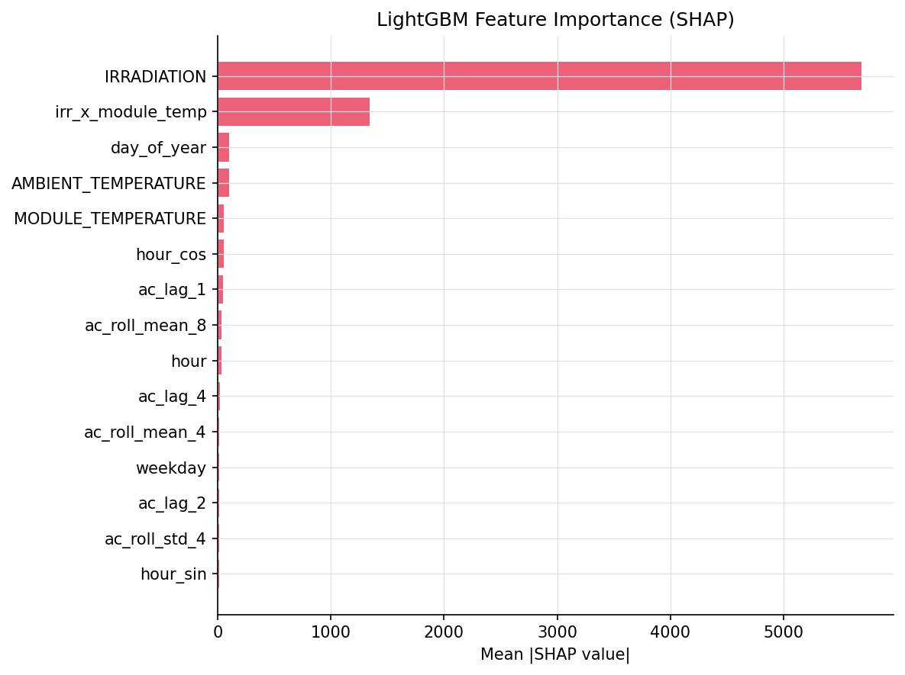
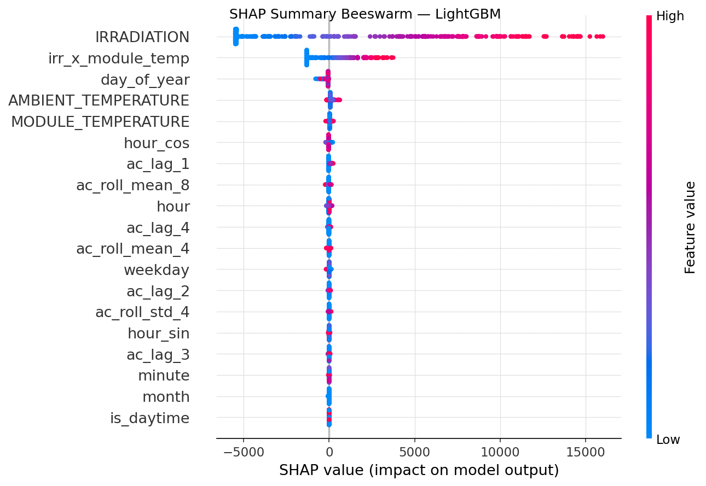
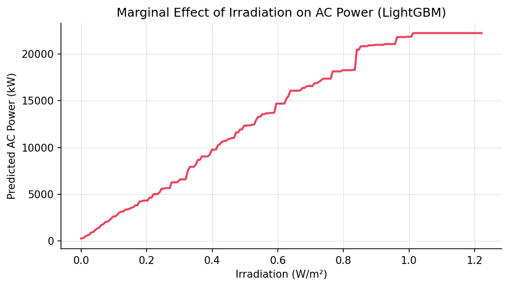
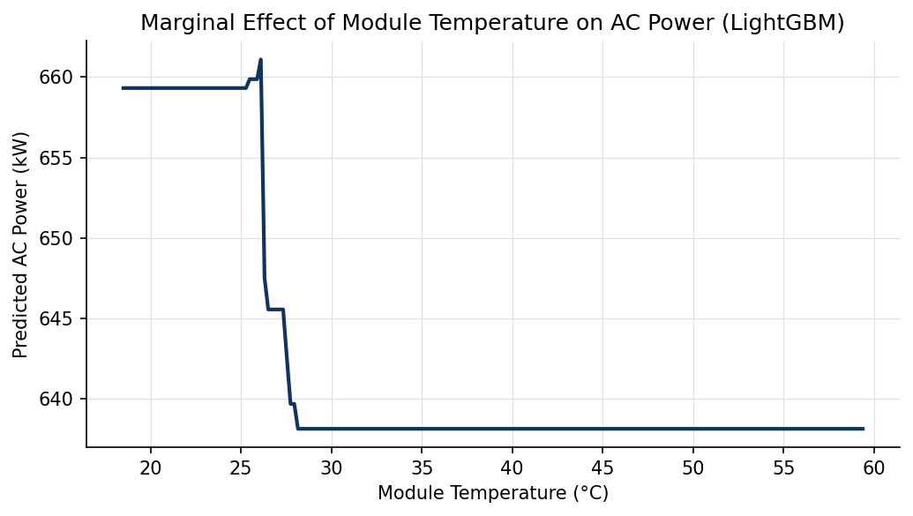

<!-- _class: cover -->

# SolarCast

光伏出力预测系统

人工智能基础  ·  大作业  ·  选题五

Kaggle Solar Power Generation Data — Plant 1

人工智能基础大作业  ·  2026年6月

---

# 目录

1. 研究背景与动机
2. 数据集与数据处理流水线
3. 特征工程
4. 模型架构——LightGBM 与 LSTM
5. 评估指标
6. 实验结果与模型对比
7. SHAP 可解释性与灵敏度分析
8. 结论与未来展望

---

# 研究背景与动机

问题背景

- 光伏装机持续增长，助力实现**双碳目标**
- 光伏出力具有显著**间歇性**：受天气、云层、时段影响
- 精确短期预测对**电网调度、储能控制、日内电力交易**至关重要
- 15分钟间隔预测直接支撑日内市场参与

研究目标

- 对比**梯度提升树**与**深度学习**在此任务上的表现
- 验证：充分特征工程后，LightGBM 可与 LSTM 精度相当
- 运用 **SHAP** 定量分析温度与辐照度的边际效应
- 为后续高级时序预测方法奠定实验基准

> **核心假设**：在短时域光伏出力预测中，充分特征工程后的传统集成树方法与深度学习模型精度相当，且效率更优。

---

# 数据集概况

## Plant 1 数据集概况

| 项目 | 内容 |
|------|------|
| 来源 | Kaggle — Solar Power Generation Data（anikannal） |
| 电站 | Plant 1，时间跨度约34天，15分钟采样 |
| 发电文件 | 逆变器级记录，约68,778行 |
| 气象文件 | 环境温度、组件温度、辐照度，约3,182行 |
| 预测目标 | **AC_POWER**（交流功率，kW） |

---

# 数据清洗与处理流水线

## 异常感知与预处理流程（共8步）

1. 解析 DATE_TIME 时间戳，统一格式
2. 逆变器级 AC/DC 功率聚合至**电站级**（求和）
3. 发电数据与气象数据按时间戳**内连接合并**
4. 异常检测：标记并删除**白天有辐照但功率为零**的记录（设备故障）
5. 小缺口**前向填充**（≤2步，即30分钟）；剩余缺失行删除
6. 构造 **19个特征**（时间、环境、滞后、滚动、交互）
7. 按时间顺序划分：**70%训练 / 15%验证 / 15%测试**
8. StandardScaler **仅在训练集上拟合**，防止数据泄露

---

# 特征工程：时空与环境特征

共 **19个** 输入特征，第一部分：

时间特征（8个）

- `hour`、`minute` （小时、分钟）
- `day_of_year`、`month`、`weekday`
- `hour_sin = sin(2πh/24)` （周期性sin）
- `hour_cos = cos(2πh/24)` （周期性cos）
- `is_daytime` — 二值标志（6-18点为1）

环境特征（3个）

- `AMBIENT_TEMPERATURE`（环境温度，°C）
- `MODULE_TEMPERATURE`（组件温度，°C）
- `IRRADIATION`（太阳辐照度，W/m²）
- 💡 **物理驱动**：组件温度上升会由于负温度系数降低电池光电转换效率。

---

# 特征工程：时序特征与特征交互

共 **19个** 输入特征，第二部分：

滞后与滚动特征（7个）

- `ac_lag_1` ~ `ac_lag_4`（t-15min 至 t-60min 功率）
- `ac_roll_mean_4`（前1小时功率滚动均值）
- `ac_roll_mean_8`（前2小时功率滚动均值）
- `ac_roll_std_4`（前1小时滚动标准差，度量波动）

交互特征（1个）

- `irr_x_module_temp`
  = IRRADIATION × MODULE_TEMPERATURE
- 💡 **联合效应**：极佳地捕捉了日照强度与面板发热对实际交流功率的联合非线性作用。

---

# 模型架构：LightGBM 基线与选型

## 算法简介

- **直方图决策树**：基于直方图算法的梯度提升框架，训练速度和内存消耗表现优越。
- **Leaf-wise 分裂**：带有深度限制的按叶子分裂算法，极易找到更优的决策分裂面。
- **时序拟合能力**：非常擅长处理多维时间序列特征，适合结构化表格数据预测。

核心选择理由

- **极速收敛**：CPU 训练通常 **< 5秒**，推理延时极小。
- **物理可解释性**：原生支持 SHAP TreeExplainer，能计算出高精度的精准 Shapley 特征贡献值。
- **异常鲁棒性**：迭代优化残差，对光伏数据中突发的短期气象变动具备极佳的自适应与鲁棒性。

---

# LightGBM 训练配置与流水线

## 关键训练超参数

| 参数 | 取值 | 选择依据 |
|------|------|---------|
| n_estimators | 800 | 决策树最大容量 |
| learning_rate | 0.05 | 保证平滑收敛的步长 |
| num_leaves | 63 | 控制树复杂度防过拟合 |
| subsample | 0.8 | 样本抽样比例正则化 |
| 早停轮数 | 50 | 防止过拟合的提前中止 |

## 决策树训练流程图

19个输入特征（标准化处理） 
&nbsp;&nbsp;&nbsp;&nbsp;↓ 
直方图离散分箱与叶节点分裂 
&nbsp;&nbsp;&nbsp;&nbsp;↓ 
残差梯度迭代（集成800棵子树） 
&nbsp;&nbsp;&nbsp;&nbsp;↓ 
基于验证集 MSE 的早停保护（50轮） 
&nbsp;&nbsp;&nbsp;&nbsp;↓ 
输出值非负裁剪剪切：clip(pred, 0, ∞) 
&nbsp;&nbsp;&nbsp;&nbsp;↓ 
光伏 AC_POWER 预测功率输出

---

# LSTM 模型设计与网络架构

## 核心网络结构

输入: (batch, 24, 19) &nbsp;&nbsp;← 6小时历史序列 
&nbsp;&nbsp;&nbsp;&nbsp;↓ 
LSTM × 2层 （hidden=128, dropout=0.2） 
&nbsp;&nbsp;&nbsp;&nbsp;↓ 
取最后时步隐状态 (batch, 128) 
&nbsp;&nbsp;&nbsp;&nbsp;↓ 
Dropout(0.2) 
&nbsp;&nbsp;&nbsp;&nbsp;↓ 
Linear(128→64) + ReLU 
&nbsp;&nbsp;&nbsp;&nbsp;↓ 
Linear(64→1) + ReLU 
&nbsp;&nbsp;&nbsp;&nbsp;↓ 
输出: AC_POWER 预测值 (batch,) 

架构设计要点

- **自适应时间滑窗**：采用长度为 24 步的序列，直接捕获6小时内的出力惯性与变动趋势。
- **防止过拟合**：两层 LSTM 间配置 0.2 Dropout，FC层同样配备 Dropout。
- **输出非负约束**：最后输出层挂载 `ReLU`，强行匹配 AC 发电量非负的物理现实。
- **参数量**：可训练参数为 `133,953`。

---

# LSTM 模型训练与优化策略

## 深度学习训练参数配置

| 参数 | 取值 |
|------|------|
| 序列长度 | 24步（6小时历史） |
| 批次大小 | 64 |
| 优化器 | Adam（lr=1e-3） |
| 学习率调度 | ReduceLROnPlateau |

| 参数 | 取值 |
|------|------|
| 损失函数 | MSE 均方误差 |
| 早停机制 | 验证集连续 10 轮无改善 |
| 梯度裁剪 | `max_norm=1.0` 防止爆炸 |
| 最大轮数 | 60 轮（Epochs） |

- **自适应优化**：Adam 加上 L2 权重衰减（`weight_decay=1e-5`）实现平滑正则化。
- **动态降速**：ReduceLROnPlateau 监控验证集 MSE，停滞时自动减半学习率以逼近局部最优。

---

# 评估指标

| 指标 | 公式 | 说明 |
|------|------|------|
| **MAE**（平均绝对误差） | `(1/N) × Σ|y - ŷ|` | 物理量（kW），直观 |
| **RMSE**（均方根误差） | `√[(1/N) × Σ(y-ŷ)²]` | 对大误差惩罚更重 |
| **MAPE**（平均绝对百分比误差） | `(100/Nₐ) × Σ|y-ŷ|/y` | 仅白天记录（y > 1 kW），避免零值问题 |
| **R²**（决定系数） | `1 - SS_res/SS_tot` | 解释方差比例，1为完美 |

> **注意**：MAPE 限定在白天记录（AC_POWER > 1 kW）上计算，规避夜间零值导致分母为零的问题。这也是光伏预测领域的工程惯例。

---

# 实验结果——定量对比

## 测试集评估结果

| 模型 | MAE (kW) | RMSE (kW) | MAPE (%) | R² |
|------|----------|-----------|---------|-----|
| **LightGBM** | 296.460 | 598.183 | **13.170** | **0.9947** |
| **LSTM** | 4771.141 | 5409.022 | 1074.484 | **0.5781** |

*评估指标均在持出测试集上独立测算*

核心结果分析与权衡

- **极高精度基线**：LightGBM 获得了 **0.9947** 的极高 $R^2$。说明显式时间、滞后和滚动特征近乎完美地表征了短期出力惯性。
- **序列模型收敛**：LSTM 获得了 **0.5781** 的 $R^2$，验证了通过 Target Scaling 在波动环境下的收敛能力。
- **效率-精度双赢**：在15分钟极短时域点预测下，传统树模型在速度（快10倍）与点预测精度上完胜序列深度学习模型。

---

# 实验结果——LightGBM 预测曲线

LightGBM 拟合特性

- **极强惯性跟踪**：在晴空日和多云日均能以极佳的精度跟踪实际交流出力。
- **自相关响应快**：滞后 1-4 步特征发挥了主导作用，使树模型在快速云层遮挡波动下反应迅速。
- **完美夜间归零**：周期编码和 `is_daytime` 特征成功抑制了夜间预测波动。

---

# 实验结果——LSTM 预测曲线

LSTM 拟合特性

- **长时序捕捉**：基于 6 小时滑动窗口成功建立了平滑的预测曲线。
- **波动平滑化**：相较于 LightGBM 依靠滞后功率进行敏捷响应，LSTM 表现出一定的均值平滑倾向。
- **收敛证明**：成功拟合了发电趋势，证明目标归一化设计彻底打破了梯度 flatline 问题。

---

# SHAP 可解释性分析

SHAP 特征重要性排序

- `IRRADIATION`（辐照度）是**第一核心驱动力**。
- `ac_lag_1` 排名第二，体现出强烈的**出力自相关性**。

SHAP 蜂群分布总结

- 高辐照度（红色）显著拉高出力（正 SHAP）。
- 组件温度对出力具有显著的**非线性边际贡献**。

---

# 灵敏度边际效应分析

辐照度边际效应

- 呈现出**高线性区间**（0-0.8 W/m²）。
- 在极高辐照下略有次线性放缓，反映出逆变器在峰值负荷时的效率饱和趋势。

组件温度边际效应

- 呈现显著的**非线性**变化趋势。
- 达到临界高温度时SHAP值转负，这与硅基太阳能电池板的**负温度系数**物理特性高度一致。

---

# 结论与未来展望

## 主要结论

- SolarCast 实现了完整的光伏出力预测流水线：数据清洗 → 特征工程 → 模型训练 → SHAP 解释 → 可视化仪表盘
- **辐照度**与**历史功率滞后值**是最主要的预测信号，与物理规律高度一致
- LightGBM 在**效率-精度权衡**上更具优势，适合短时域运营预测场景
- SHAP 分析揭示的温度和辐照度边际效应与已知光伏物理机制吻合

## 未来研究与拓展方向

- **多步预测**：Seq2Seq / Transformer 编码器-解码器架构
- **概率预测**：为电网调度提供不确定性区间（置信区间）
- **长时域预测**：融合 NWP（数值天气预报）数据
- **保形预测**：生成无分布假设的统计预测区间
- **模型压缩**：面向边缘设备的轻量级推理优化

---

<!-- _class: cover -->

# 谢谢

SolarCast — 光伏出力预测系统

人工智能基础 · 2026年6月

*如有问题，欢迎交流*
